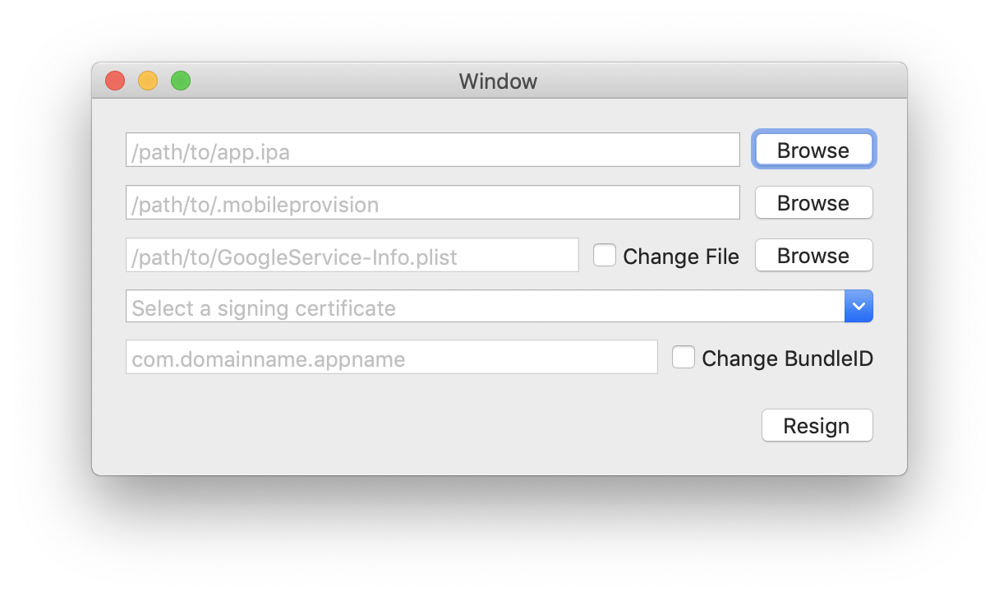

# SwiftReSign

SwiftResign allows you to re-sign unencrypted ipa-files with any certificate for which you hold the corresponding private key.

## How to use

1. Browse your *.ipa* file to the top box.
2. Browse your *provisioning profile* to the second box. (Optional)
3. Browse your *GoogleService-Info.plist* file to the third box (Optional)
4. Select *signing certificate* from *Keychain Access* in the bottom box.
5. In the last box your can change app *bundle identifier*. (Optional)
6. Click Resign The resigned file will be saved in the same folder as the original file.

**NOTE:** Pay attention to the right pair between *signing certificate* and *provisioning profile* by *app bundleID* and scheme, like: develop, ad-hoc or enterprise.

## Requirements

- Xcode 8.0
- MacOS High Sierra
- Swift 4.0
